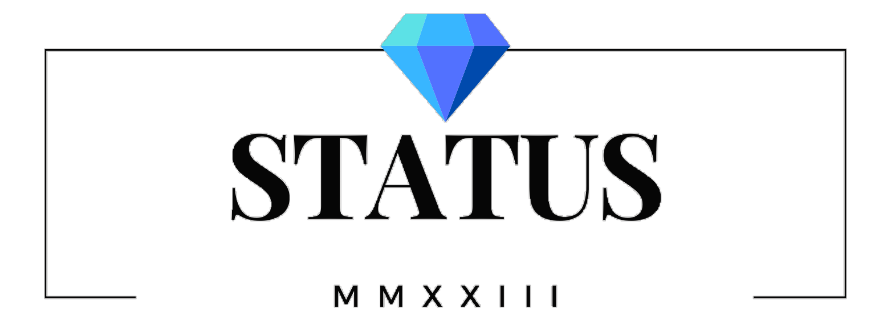

<!-- Improved compatibility of back to top link: See: https://github.com/othneildrew/Best-README-Template/pull/73 -->

<!--
*** Thanks for checking out the Best-README-Template. If you have a suggestion
*** that would make this better, please fork the repo and create a pull request
*** or simply open an issue with the tag "enhancement".
*** Don't forget to give the project a star!
*** Thanks again! Now go create something AMAZING! :D
-->

<!-- PROJECT SHIELDS -->
<!--
*** I'm using markdown "reference style" links for readability.
*** Reference links are enclosed in brackets [ ] instead of parentheses ( ).
*** See the bottom of this document for the declaration of the reference variables
*** for contributors-url, forks-url, etc. This is an optional, concise syntax you may use.
*** https://www.markdownguide.org/basic-syntax/#reference-style-links
-->

<!-- PROJECT LOGO -->
 

  

<h3 align="center">Status</h3>

  

    University Project to E-commerce website
     
    <a href="https://github.com/Stephen-Zheng-bao/SpringBoot"><strong>Explore the docs »</strong></a>
     
     
    <a href="https://github.com/Stephen-Zheng-bao/SpringBoot">View Demo</a>
    ·
    <a href="https://github.com/Stephen-Zheng-bao/SpringBoot">Report Bug</a>
    ·
    <a href="https://github.com/Stephen-Zheng-bao/SpringBoot">Request Feature</a>
  

<!-- TABLE OF CONTENTS -->

  
Table of Contents

  <ol>
    <li>
      <a href="#about-the-project">About The Project</a>
      <ul>
        <li><a href="#built-with">Built With</a></li>
      </ul>
    </li>
    <li>
      <a href="#getting-started">Getting Started</a>
      <ul>
        <li><a href="#prerequisites">Prerequisites</a></li>
        <li><a href="#installation">Installation</a></li>
      </ul>
    </li>
    <li><a href="#usage">Usage</a></li>
    <li><a href="#roadmap">Roadmap</a></li>
    <li><a href="#contributing">Contributing</a></li>
    <li><a href="#license">License</a></li>
    <li><a href="#contact">Contact</a></li>
    <li><a href="#acknowledgments">Acknowledgments</a></li>
  </ol>

<!-- ABOUT THE PROJECT -->
## About The Project

Product Name Screen Shot 
)

The goal of this project is to develop a high quality ecommerce website that is aimed at high income earners, aged 28-38 years old. The product we are selling is high end jewellery. We have numerous categories including bracelets, watches, necklaces, and rings. Our typical customers earn about £40,000 to £60,000 per annum, are high class professionals, well established in their career and care about their status, hence the name of the business. We used the spring boot framework, as well as HTML, CSS and JavaScript to develop the website. We have adopted agile project management.

(<a href="#readme-top">back to top</a>)

### Built With

* [![Spring Boot][Spring.js]][Spring-url]
* HTML
* CSS
* JavaScript

(<a href="#readme-top">back to top</a>)

<!-- GETTING STARTED -->
## Getting Started

This is an example of how you may give instructions on setting up your project locally.
To get a local copy up and running follow these simple example steps.

### Prerequisites

Make sure that Java works on your system as well as Maven. You also need a TomCat to be able to run the system

### Installation

Make sure that Java works on your system

1. Download the File on your System
2. Run the Maven
3. Make a database in your prefere database
3. Change your info in "src/main/resources/application.properties" to suit your database - currently it uses Mysql but you can look at springboot database Dependencies to suit your need. Currently the database name is called Java
4. Run the "src/main/java/com/example/demo/DemoApplication.java" to run the server

(<a href="#readme-top">back to top</a>)

<!-- USAGE EXAMPLES -->
## Usage

The Project can be used to produced an ecommerce website

(<a href="#readme-top">back to top</a>)

See the [open issues](https://github.com/github_username/repo_name/issues) for a full list of proposed features (and known issues).

(<a href="#readme-top">back to top</a>)

<!-- CONTRIBUTER -->
## Contributer

Stephen Zheng (Back-end)

Warren Orme (Back-end) 

Viktorija Stepanova (Front-end) 

Amariah Rigodon (Front-end) 

Mohammed Hussain (Front-end) 

Ehsan Hussain (Front-end)

Seemon Jomon (Front-end)

Abdalla Abdi (Front-end)

Ruth Amponsah (Front-end)

(<a href="#readme-top">back to top</a>)

<!-- CONTACT -->
## Contact

Stephen Zheng - stpehenzbo@gmail.com

Project Link: [(https://github.com/Stephen-Zheng-bao/SpringBoot)]([https://github.com/Stephen-Zheng-bao/SpringBoot])

(<a href="#readme-top">back to top</a>)

<!-- ACKNOWLEDGMENTS -->
## Acknowledgments

* This is a school project to make a website

(<a href="#readme-top">back to top</a>)

<!-- MARKDOWN LINKS & IMAGES -->
<!-- https://www.markdownguide.org/basic-syntax/#reference-style-links -->
[contributors-shield]: https://img.shields.io/github/contributors/github_username/repo_name.svg?style=for-the-badge
[contributors-url]: https://github.com/github_username/repo_name/graphs/contributors
[forks-shield]: https://img.shields.io/github/forks/github_username/repo_name.svg?style=for-the-badge
[forks-url]: https://github.com/github_username/repo_name/network/members
[stars-shield]: https://img.shields.io/github/stars/github_username/repo_name.svg?style=for-the-badge
[stars-url]: https://github.com/github_username/repo_name/stargazers
[issues-shield]: https://img.shields.io/github/issues/github_username/repo_name.svg?style=for-the-badge
[issues-url]: https://github.com/github_username/repo_name/issues
[license-shield]: https://img.shields.io/github/license/github_username/repo_name.svg?style=for-the-badge
[license-url]: https://github.com/github_username/repo_name/blob/master/LICENSE.txt
[linkedin-shield]: https://img.shields.io/badge/-LinkedIn-black.svg?style=for-the-badge&logo=linkedin&colorB=555
[linkedin-url]: https://linkedin.com/in/linkedin_username
[product-screenshot]: images/screenshot.png
[Next.js]: https://img.shields.io/badge/next.js-000000?style=for-the-badge&logo=nextdotjs&logoColor=white
[Next-url]: https://nextjs.org/
[Spring.js]:https://img.shields.io/badge/SpringBoot-6DB33F?style=flat-square&logo=Spring&logoColor=white
[Spring-url]:https://spring.io/
[React.js]: https://img.shields.io/badge/React-20232A?style=for-the-badge&logo=react&logoColor=61DAFB
[React-url]: https://reactjs.org/
[Vue.js]: https://img.shields.io/badge/Vue.js-35495E?style=for-the-badge&logo=vuedotjs&logoColor=4FC08D
[Vue-url]: https://vuejs.org/
[Angular.io]: https://img.shields.io/badge/Angular-DD0031?style=for-the-badge&logo=angular&logoColor=white
[Angular-url]: https://angular.io/
[Svelte.dev]: https://img.shields.io/badge/Svelte-4A4A55?style=for-the-badge&logo=svelte&logoColor=FF3E00
[Svelte-url]: https://svelte.dev/
[Laravel.com]: https://img.shields.io/badge/Laravel-FF2D20?style=for-the-badge&logo=laravel&logoColor=white
[Laravel-url]: https://laravel.com
[Bootstrap.com]: https://img.shields.io/badge/Bootstrap-563D7C?style=for-the-badge&logo=bootstrap&logoColor=white
[Bootstrap-url]: https://getbootstrap.com
[JQuery.com]: https://img.shields.io/badge/jQuery-0769AD?style=for-the-badge&logo=jquery&logoColor=white
[JQuery-url]: https://jquery.com 
